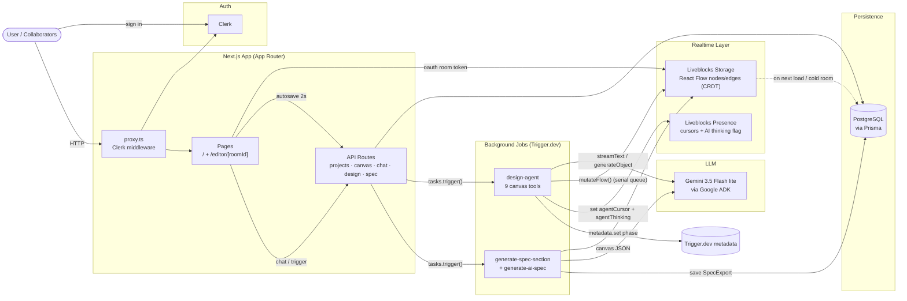

# KubeCanvas

> A real-time collaborative system design workspace where you describe a system in plain English and an AI agent builds it on a shared canvas, then collaborators refine the architecture and export a technical spec.


## Demo

<!-- Replace the placeholder below with a project demo GIF once recorded. -->
<!-- Recommended: keep the gif under ~8MB and use a 16:9 aspect ratio. -->

<p align="center">
  <em>demo gif coming soon</em>
</p>

## Tech Stack

| Technology | Role |
|---|---|
| Next.js 16 | Full-stack app with App Router server/client boundaries |
| TypeScript | Type safety across client, server, and background tasks |
| Tailwind v4 + shadcn/ui | Component composition and dark glassmorphism design system |
| React Flow v12 | Interactive node/edge canvas with custom shapes and handles |
| Liveblocks | Real-time collaborative canvas, presence, and live cursors (CRDT Storage) |
| Clerk | User identity and route protection |
| Prisma + PostgreSQL | Durable storage for projects, collaborators, chat history, spec exports, and canvas snapshots |
| Trigger.dev | Durable background tasks for AI design generation and spec export |
| Google Gemini (AI SDK v7) | Chat agent, architecture generation, and natural-language summaries |
| dagre | Directed graph layout for canvas cleanup and AI node placement |
| Bun | Package manager and script runner |

## Why this project

Designing a system usually means jumping between a whiteboard, a chat thread, and a doc — context gets lost the moment the call ends. KubeCanvas keeps the whole flow in one room: you and your collaborators brainstorm on a shared canvas, an AI companion sits alongside to clarify trade-offs and, when you ask, actually builds the diagram on top of what's already there. When the design is ready, export a structured technical spec you can hand straight to a coding assistant like Codex, Claude Code, or OpenCode and start building — without re-explaining the architecture.

## Architecture (HLD)



## Project Structure

```
kubecanvas/
├─ app/
│  ├─ api/                     # Authenticated REST handlers
│  │  ├─ ai/
│  │  │  ├─ chat/              # Unified AI chat (streamText + generateArchitecture tool)
│  │  │  ├─ design/            # Design trigger, cancel, revert, poll, token
│  │  │  └─ export-spec/       # Spec export trigger + download endpoints
│  │  ├─ liveblocks-auth/      # Room access token issuance (Clerk-verified)
│  │  └─ projects/             # Project CRUD, collaborators, access revocation, canvas get/put
│  ├─ editor/
│  │  ├─ [roomId]/             # Workspace: server page + canvas-editor + workspace-shell
│  │  ├─ editor-layout-client  # Client layout shell
│  │  └─ page.tsx              # Editor home (project list)
│  ├─ sign-in / sign-up        # Clerk auth routes (redirect to landing modal)
│  ├─ layout.tsx               # Root layout + ClerkProvider + theme
│  └─ page.tsx                 # Landing page with inline auth modal
├─ components/
│  ├─ editor/                  # Canvas surfaces, AI sidebar, cursors, controls, dialogs
│  ├─ landing/                  # Landing page client component
│  └─ ui/                      # shadcn/ui primitive components + custom glass/primitive components
├─ hooks/                      # useAutosave, useCanvasHistory, useKeyboardShortcuts, useProjectActions
├─ lib/                        # Prisma client, Liveblocks client, access control, canvas layout, guardrails, formatting
├─ trigger/                    # Trigger.dev task modules
│  ├─ design-agent.ts          # Tool-based AI architect (9 canvas mutation tools)
│  ├─ generate-ai-spec.ts      # Spec orchestrator
│  ├─ generate-spec-section.ts # Per-section spec generation
│  └─ ai_system_prompt.ts      # Unified chat + architect system prompt
├─ prisma/                     # Schema + migrations
├─ types/                      # Shared canvas + task Zod schemas
├─ liveblocks.config.ts        # Presence + Storage type bindings
├─ trigger.config.ts           # Trigger.dev build config (Prisma extension)
├─ proxy.ts                    # Clerk middleware (route protection)
└─ next.config.ts
```

## How to Run Locally

### Prerequisites

- [Bun](https://bun.sh) (recommended) or npm
- A running PostgreSQL database
- Accounts + keys for Clerk, Liveblocks, Trigger.dev, and Google AI (Gemini)

### Setup

```bash
# Install dependencies (postinstall runs prisma generate)
bun install

# Configure environment
cp .env.example .env.local
# ... fill in your keys (see Environment Variables below)

# Apply database migrations
bunx prisma migrate dev

# Start the dev server
bun run dev
```

For the background AI agents you also need the Trigger.dev dev server in a separate terminal:

```bash
bun run trigger:dev
```

Open [http://localhost:3000](http://localhost:3000) — you'll land on the marketing page; sign in via the modal to enter the editor.

### Build

```bash
bun run build     # runs prisma generate && next build
bun run start     # serve the production build
```

### npm equivalent

```bash
npm install
npx prisma migrate dev
npm run dev
npx trigger.dev@latest dev
```

## Environment Variables

Copy `.env.example` to `.env.local` and fill in each value. The same set must also be set in the **Trigger.dev dashboard** for the background tasks (not just `.env.local`) since the build eval runs without your local env.

| Variable | Purpose |
|---|---|
| `NEXT_PUBLIC_CLERK_PUBLISHABLE_KEY` | Clerk auth (client-side) |
| `CLERK_SECRET_KEY` | Clerk auth (server-side) |
| `NEXT_PUBLIC_CLERK_SIGN_IN_URL` | Clerk sign-in route |
| `NEXT_PUBLIC_CLERK_SIGN_UP_URL` | Clerk sign-up route |
| `DATABASE_URL` | PostgreSQL connection string used by Prisma |
| `LIVEBLOCKS_PUBLIC_KEY` | Liveblocks client (rooms, presence) |
| `LIVEBLOCKS_SECRET_KEY` | Liveblocks server (auth, storage access, presence REST) |
| `TRIGGER_SECRET_KEY` | Trigger.dev SDK auth |
| `TRIGGER_PROJECT_REF` | Your Trigger.dev project ref (`proj_...`) |
| `GOOGLE_AI__API_KEY` | Google AI key for Gemini AI models |
| `GEMINI_MODEL` | Model identifier (e.g. `gemini-3.5-flash-lite`) |

## License

MIT License. Copyright (c) 2026 Amandeep.

Permission is hereby granted, free of charge, to any person obtaining a copy of this software and associated documentation files (the "Software"), to deal in the Software without restriction, including without limitation the rights to use, copy, modify, merge, publish, distribute, sublicense, and/or sell copies of the Software, and to permit persons to whom the Software is furnished to do so, subject to the following conditions:

The above copyright notice and this permission notice shall be included in all copies or substantial portions of the Software.

THE SOFTWARE IS PROVIDED "AS IS", WITHOUT WARRANTY OF ANY KIND, EXPRESS OR IMPLIED, INCLUDING BUT NOT LIMITED TO THE WARRANTIES OF MERCHANTABILITY, FITNESS FOR A PARTICULAR PURPOSE AND NONINFRINGEMENT. IN NO EVENT SHALL THE AUTHORS OR COPYRIGHT HOLDERS BE LIABLE FOR ANY CLAIM, DAMAGES OR OTHER LIABILITY, WHETHER IN AN ACTION OF CONTRACT, TORT OR OTHERWISE, ARISING FROM, OUT OF OR IN CONNECTION WITH THE SOFTWARE OR THE USE OR OTHER DEALINGS IN THE SOFTWARE.
